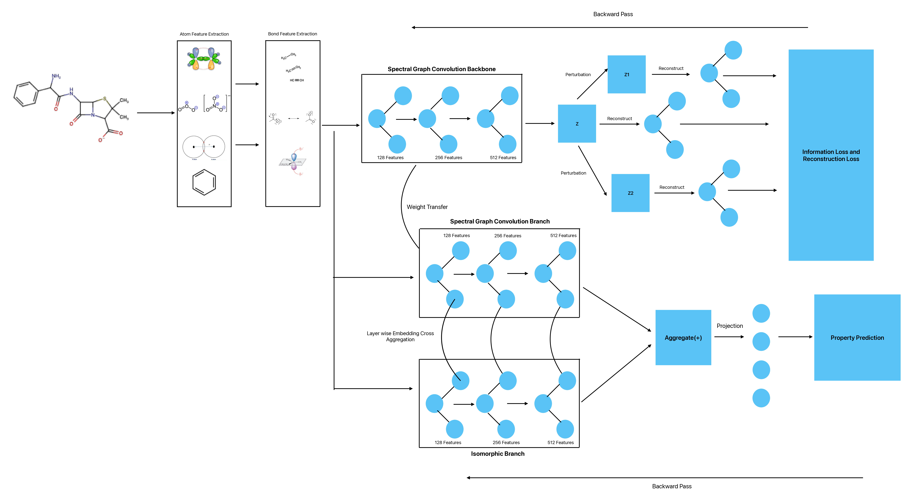

# Molecular Property Prediction using Contrastive Learning and Graph Isomorphism



## Running the Scripts
- Follow the procedure in the documentation in our graph creation repository <a href="https://github.com/Deceptrax123/Molecular-Graph-Featuriser">here</a> to save all the molecular graphs for all datasets.
- Install the requirements by running: 
  ```sh
  pip install -r requirements.txt
  ```
- The weights for the pre-trained spectral backbone can be downloaded from our release. The weights are saved as ```.pt``` files which can directly be loaded in the training scripts. The procedures used for pre-training the backbone can be found <a href="https://github.com/Deceptrax123/Molecular-Graph-Representation-Learning-through-Adversarial-Training">here</a>
- Load the pre-trained weights in the ```train.py``` file of each dataset folder. Each train file is named as per the dataset, change the name of the script accordingly before running.
- Before running the train scripts, insert the paths for the location of the saved graph tensors and the pre-trained backbone. A detailed list of keys used in the ```.env``` file is given below. 
- Change the path for saving the model based on your convenience. Ensure that the folder is created before saving the models.
- The saved models can be loaded in the ```test.py``` of each dataset for inference. The primary metric is ROC-AUC for classification and RMSE for regression.

## Path Variables
|Key|Value|
|---|------|
|zinc_weights|/path/to/zinc/pretrained.pt|
|graph_files|path/to/graphs/data/processed/|

We will release the weights for the trained models soon. You may send an email or raise an issue if there are any bugs. Have fun!!!
